# Nestについて調べたことを記録する

## NestJSはMVCやMVPフレームワークではない
***
Webアプリケーションのサーバーとしての機能を提供するために作られている。  
最初の定型ファイルにはModelもViewもない。  

Service同士のつながりとしてアプリケーションが構築される。  
Controllerへと実態に即した粒度で機能が提供される。  



## NestJSの全体像
***


Requestに作用する概念として以下の4つがある。
- Middleware
- Guard
- Interceptor
- Pipe

Responseに作用する概念として以下の3つがある。
- Interceptor
- Exception Filter

上記の5つの概念のうち、Middlewareを除く4つには次の4つのレベルがある。
- Global：グローバルなレベル
- Controller：コントローラーのレベル
- Method：メソッドのレベル
- Param：パラメータのレベル、Pipeのみ設定可能

### Controller
***
Controllerには次の特徴がある。
- `@Controller()`デコレータを適用したクラス
- 指定したパスでリクエストを受け取りレスポンスを返す役割を持つ
- Providerが提供するサービスを利用する
- 特定のModuleに属する

作成する時のコマンド: `nest g controller <name>`  
テスト用ファイルがいらない場合は、`--no-spec`を指定する。  
作成したコントローラーを使用するには、Moduleへ登録する。  

### Provider
***
Provider(Service)には次の特徴がある。
- `@Injectable()`デコレータを適用したクラス
- 依存する対象を注入する
- Controllerから利用される

作成する時のコマンド: `nest g service <name>`  
作成したサービスを使用するには、Moduleへ登録する。

### Module
***
Provider(Service)には次の特徴がある。
- `@Module()`デコレータを適用したクラス
- 以下の要素から構成される
  - **providers**: Nest injector によりインスタンス化される Provider で、Module 内でシェアされる
  - **controllers**: Module で定義される Controller
  - **imports**: Module で使用する Provider をエクスポートしている他の Module
  - **exports**: Module からエクスポートされる Provider
- Nest アプリケーションは、少なくとも一つの Module (これを Root module という) を必要とし、これと他のインポートされた Module の連鎖である application graph によって構成される
- 特定の役割に応じて一つの Module が構成されるべき
- `@Global()`デコレータを適用した Module は、グローバルに利用可能
- 動的に使用する Provider を切り替えることも可能

作成する時のコマンド: `nest g module <name>`  

### Middleware
***
Middlewareには次の特徴がある。
- Routeハンドラの前に呼び出される関数で、**リクエストやレスポンスのオブジェクトへアクセス可能**
- ExpressのMiddlewareと同等
- 以下のようなことが可能
  - コードの実行
  - リクエストやレスポンスオブジェクトの変更
  - リクエスト・レスポンスのサイクルを終わらせる
  - 他のMiddleware呼べる
- 関数、または`@Injectable()`デコレータを適用したクラスとして実装する

作成する時のコマンド: `nest g middleware common/middleware/<name>`  
<small>※ディレクトリは特にcommon配下とか決まりはないのでPJごとに決定する</small>  

実装する方法
```ts
import { Injectable, NestMiddleware } from "@nestjs/common";
import { Request, Response, NextFunction } from "express";

// @Injectable() デコレータの適用したクラスで定義する場合
@Injectable()
export class LoggerMiddleware implements NestMiddleware {
  use(req: Request, res: Response, next: NextFunction) {
    console.log("Request..."); // Middleware の処理
    next(); // 次の関数へとコントロールを引き渡す
  }
}

// 関数として定義する場合（公式推奨）
export function logger(req: Request, res: Response, next: NextFunction) {
    console.log(`Request...`);
    next();
}
```

適用する方法
```ts
import { Module, NestModule, MiddlewareConsumer } from "@nestjs/common";
import { LoggerMiddleware } from "./common/middleware/logger.middleware";
import { CatsModule } from "./cats/cats.module";

@Module({
  imports: [TasksModule],
})
export class AppModule implements NestModule { // NestModule インターフェースの実装
  configure(consumer: MiddlewareConsumer) {
    consumer
      .apply(LoggerMiddleware) // Middleware の適用
      .forRoutes("tasks"); // 適用対象の Route を指定
  }
}
```

グローバルにMiddlewareを登録する方法
```ts
const app = await NestFactory.create(AppModule);
app.use(LoggerMiddleware);
```

### Exception filter
***
Exception filterには次の特徴がある。
- HttpException をハンドルする組み込みの Global exception filter の制御フローと、それがクライアントへと送り返すレスポンスをコントロールする
- デフォルトでは、この Global exception filter が例外を検出し HTTP レスポンスへと変換する
- @Catch() デコレータを適用し、ExceptionFilter インターフェース を実装したクラス

作成する時のコマンド: `nest g filter common/filters/<name>`  
<small>※ディレクトリは特にcommon配下とか決まりはないのでPJごとに決定する</small>

### Pipe
***
Pipeには次の特徴がある。
- @Injectable() デコレータを適用し、PipeTransform インターフェースを実装したクラス
- 大きく二つのユースケース
  - 変換: インプットされたデータを変換する (たとえば文字列から整数へ)
  - バリデーション: インプットされたデータに問題がなければ次の処理へと引き継ぎ、問題があれば例外を送出する

作成する時のコマンド: `nest g pipe common/pipes/<name>`
<small>※ディレクトリは特にcommon配下とか決まりはないのでPJごとに決定する</small>

### Guard
***
Guardには次の特徴がある。
- @Injectable() デコレータを適用し、CanActivate インターフェースを実装したクラス
- (権限やロール、ACL 等の) 特定の条件に応じて、リクエストがハンドラによって処理されるべきかどうかを決定する

作成する時のコマンド: `nest g guard common/guards/<name>`
<small>※ディレクトリは特にcommon配下とか決まりはないのでPJごとに決定する</small>

### Interceptor
***
Interceptorには次の特徴がある。
- @Injectable() デコレータを適用し、NestInterceptor インターフェースを実装したクラス
- 以下のことなどが可能
  - メソッドの実行の前後において追加のロジックをバインド
  - 関数の返り値を変換する
  - 関数から送出された例外を変換する
  - 関数の振る舞いを拡張する
  - リクエストからレスポンスまでに掛かった時間を確認したり、ハンドラから返されたレスポンスや例外を書き換える例がある

作成する時のコマンド: `nest g interceptor common/interceptors/<name>`
<small>※ディレクトリは特にcommon配下とか決まりはないのでPJごとに決定する</small>


## 参考文献
***
[マークダウン記法](https://qiita.com/kamorits/items/6f342da395ad57468ae3)
